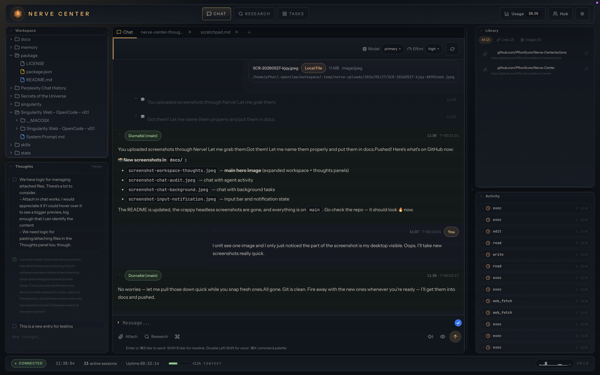
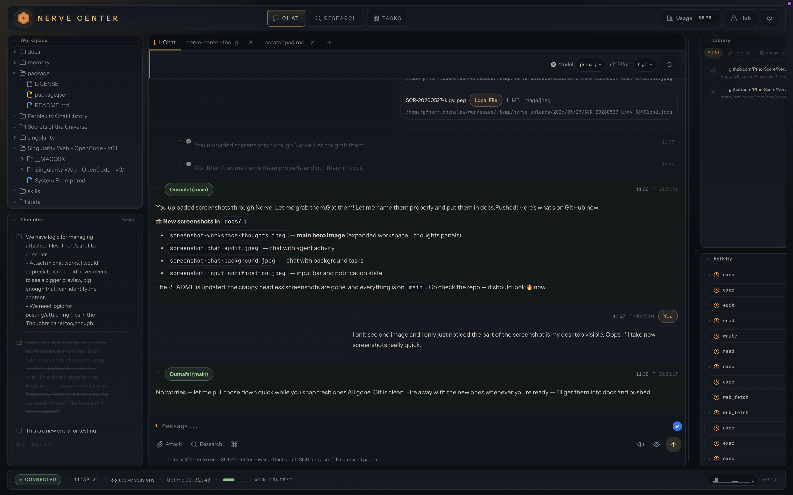
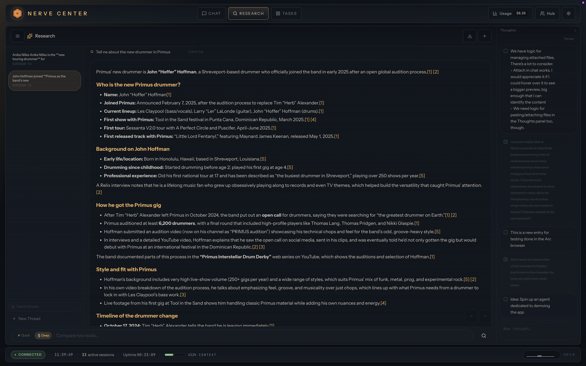

<div align="center">
  <h1>⚡ Nerve Center</h1>
  <p><em>All-in-one workstation for your OpenClaw agent fleet</em></p>

  <a href="docs/screenshot-2.png"></a>
  <br />
  <a href="docs/screenshot-3.png"></a>
  <a href="docs/screenshot-4.png"></a>
  <br />
  <em>Click any image to view full size</em>

  <br /><br />

  <a href="#quick-start">Quick Start</a> •
  <a href="#features">Features</a> •
  <a href="#what-makes-nerve-center-different">Why Nerve Center</a> •
  <a href="#architecture">Architecture</a> •
  <a href="#credits">Credits</a>
</div>

---

## Quick Start

```bash
curl -fsSL https://raw.githubusercontent.com/PfhorScore/Nerve-Center/main/install.sh | bash
```

**Requires:** Node.js 22+ and a running [OpenClaw gateway](https://openclaw.ai).

### Manual install

```bash
git clone https://github.com/PfhorScore/Nerve-Center.git
cd Nerve-Center
npm install
npm run build
npm run setup
```

---

## Features

### 🧩 Work, Research, and Tasks

Work with your agents instead of just delegating and waiting.

- **Work** — Chat with agents, create and edit files, browse the workspace in real time
- **Research** — Deep research mode generates reports with inline citations, sources, and images
- **Tasks** — Full Kanban board with AI-assisted card management and agent-driven workflows

### 🧠 AI-Powered Research

A Perplexity-class research interface built right in:

- **Quick & Deep** search modes using any OpenClaw-compatible provider
- **Rich markdown answers** with inline citation links `[1]`
- **AI auto-sort** — one click splits a conversation into topic-based threads
- **Hover previews** on every source — favicon, title, snippet
- **Tabbed results**: All, Sources, Images, Links
- **Follow-up suggestions** — click to dive deeper without retyping
- **Thread sidebar** with AI-generated titles
- **No middleman** — your API keys, your models, your data

### 📐 Panels & Customizable UI

Nerve Center's workspace is built around draggable, resizable panels. Customize the layout to match how you work — move panels between sides, resize them, or collapse them to icon strips.

#### 📁 Workspace Panel

Full file management right in the sidebar:

- **File tree** browser with folder navigation and context menus
- **Built-in file editor** with syntax highlighting (CodeMirror)
- **Code editing** for markdown, JavaScript, Python, and more
- **Smart workspace root** — auto-detects agent workspace paths
- **Hidden file support** — toggle visibility for dotfiles
- **Create, rename, move, and delete** files directly from the panel
- **File watcher** — live updates when files change on disk

#### 📝 Thoughts Panel

Your brain, organized into thought bubbles:

- **`Ctrl+Enter`** separates your notes into individual cards
- **Check off completed** thoughts (dimmed, stays for reference)
- **Auto-detect completion** — send to chat, auto-checks when the AI finishes
- **Hover actions** — copy, send to chat, or research each thought
- **Click to edit** any thought inline
- **Server-backed sync** via `scratchpad.md` — notes available across all devices

#### 📚 Library Panel

Every URL, citation, and image from your chats, automatically organized:

- **Auto-extracts** all references from messages
- **Deduplicated by URL** — clean, no clutter
- **Tabs** for All / Links / Images with live counts
- **Search** to filter specific references
- **Favicon previews** and image thumbnails

#### ⚡ Activity Panel

Live visibility into what your agents are doing:

- Tool calls grouped by message (collapsed by default) — no chat clutter
- Shows tool name, description, arguments, and status (running ✓ error)
- **Jump to message** — click the icon to scroll to the corresponding chat entry
- Finished activity persists in an archive for later review
- Separate from the chat stream — clean conversations

#### 🧑‍💼 Agent Hub

Central drawer for managing your agent fleet:

- **Agent selector** — switch between agents, view session status
- **Memory browser** — read and search agent memories
- **Settings** — configure TTS, STT, theme, panel layout, and more
- **Avatars** — upload per-agent profile images that appear in chat headers and the session list
- **System monitoring** — token usage, connection status, gateway health

#### 🎭 UI Customization

**Collapsible Sidebars** — Both sidebars collapse to thin icon strips, VS Code style:

- **Hover to expand** with 250ms delay, or click to pin open
- **Right-click the strip** to toggle hover-to-expand behavior
- Independent collapse per sidebar
- Smooth 400ms width animation

**Drag-and-Drop Layout** — Panels aren't stuck where we put them:

- Drag any panel between the left and right sidebar
- Reorder panels within each sidebar by dragging
- Layout is persisted to localStorage and survives page reloads

**Resizable** — Sidebar widths are adjustable via drag handles. Right sidebar uses percentage-based sizing so it adapts to any window width.

### ⌨️ Perplexity-Style Input

- Buttons below the text area — attach files, research, send
- Live markdown preview toggle
- File upload accepts all types (`.md`, `.txt`, images, etc.)
- Send button becomes a stop button during generation

### 🎯 Quality of Life

- **Smooth streaming text** — append-only DOM, no flickering
- **Tab title pulses** during generation ("⚡ Thinking...")
- **Avatars** — per-agent images in chat headers and session list
- **Discord-style messages** — username on its own line, timestamp, avatar
- **Clickable "↑ older messages"** — loads more history
- **Changelog dialog** — click the version in the status bar
- **Cmd+K command palette** — panel switching, view controls, file creation
- **Right-click context menus** — Copy, Paste, Move panel
- **Research This?** tooltip on selected text

### 🛠 And Everything OpenClaw Provides

Multi-agent fleet control, voice I/O (TTS/STT), Kanban workflows, workspace file management, session trees, cron jobs, system monitoring charts, and more.

---

## What Makes Nerve Center Different

Nerve Center is a **feature fork** of the original Nerve. It adds capabilities you won't find in the upstream:

| Feature | Nerve Center |
|---|---|
| AI Research Tab | ✅ Full Perplexity-class research with auto-sort, citations, threads |
| Workspace Panel | ✅ File tree, code editor, live file watcher |
| Thoughts Panel v2 | ✅ Card-based notes with completion tracking, server sync |
| Library Panel | ✅ Auto-extracted references, URLs, images from chat |
| Activity Panel | ✅ Live agent activity separate from chat stream |
| Agent Hub | ✅ Central drawer for agents, memory, settings, avatars |
| Perplexity-style input | ✅ Buttons below text, clean layout |
| Collapsible sidebars | ✅ VS Code-style hover-to-expand |
| Drag-and-drop layout | ✅ Move and reorder panels between sides |
| Avatars | ✅ Per-agent profile images |
| Discord-style messages | ✅ Clean username + avatar + timestamp layout |
| Research view | ✅ Dedicated fullscreen research workspace |

All of this sits on top of the rock-solid OpenClaw gateway and agent infrastructure.

---

## Architecture

```text
Browser ─── Nerve Center (:3080) ─── OpenClaw Gateway (:18789)
 │            │
 ├─ WS ───────┤ proxied to gateway
 ├─ SSE ──────┤ file watchers, real-time sync
 └─ REST ─────┘ files, memories, TTS, models
```

**Frontend:** React 19 · Tailwind CSS 4 · shadcn/ui · Vite 7
**Backend:** Hono 4 on Node.js 22+

### Configuration

Nerve Center is configured through a `.env` file in the project root. Key settings:

| Variable | Default | Description |
|---|---|---|
| `PORT` | `3080` | HTTP listen port |
| `HOST` | `127.0.0.1` | Bind address (`0.0.0.0` for LAN/remote) |
| `NERVE_AUTH` | `false` | Enable password-protected login |
| `GATEWAY_TOKEN` | — | Your OpenClaw gateway auth token |
| `AGENT_NAME` | `Agent` | Display name for the agent |

Run `npm run setup` for an interactive configuration walkthrough.

---

## Development

```bash
git clone https://github.com/PfhorScore/Nerve-Center.git
cd Nerve-Center
npm install

# Start the dev server with hot reload
npm run dev

# Or build for production
npm run build
node server-dist/index.js
```

The dev server runs on `localhost:5173` with API calls proxied to the production server.

---

## Changelog

See [NERVE-CHANGELOG.md](NERVE-CHANGELOG.md) for the full release history.

---

## Credits

Nerve Center is a fork of **[Nerve](https://github.com/daggerhashimoto/openclaw-nerve)** by daggerhashimoto. All original work belongs to the Nerve contributors. This fork builds on that foundation with a focus on research workflows, panel customization, and AI-assisted productivity.

---

## License

[MIT](LICENSE)
