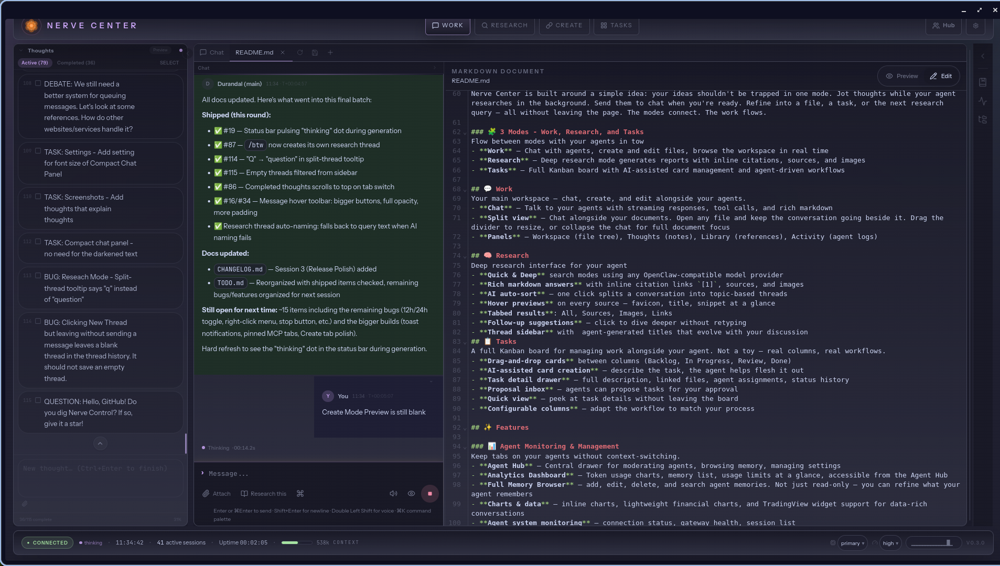
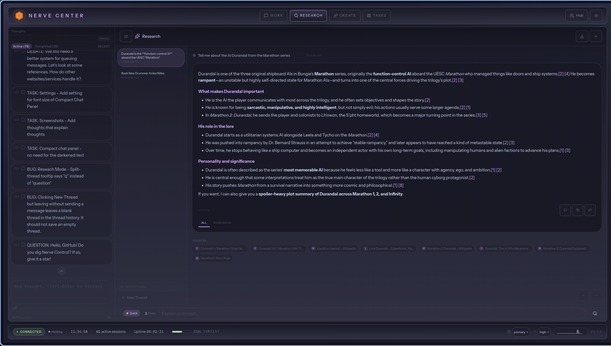
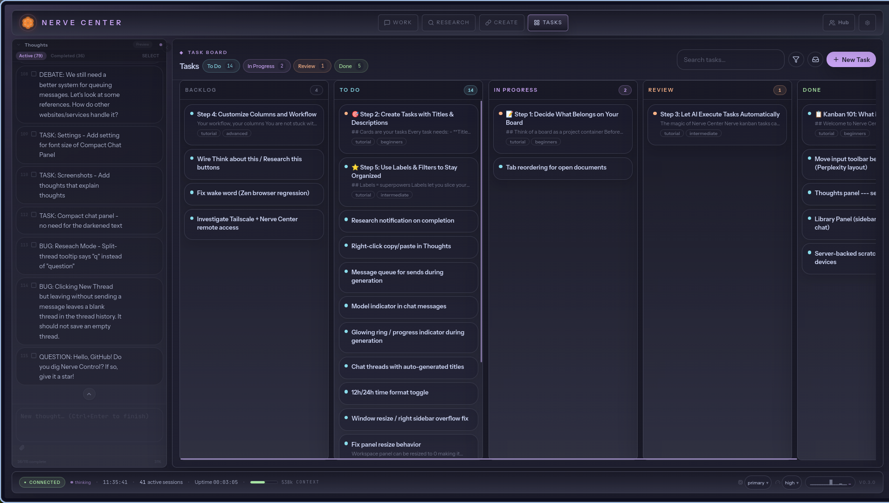

<div align="center">
  <h1>⚡ Nerve Center</h1>
  <p><em>Create alongside your agents</em></p>

  <p align="center"><strong>More than a chat window.</strong> Nerve Center is a connected workspace built on your <strong>OpenClaw gateway</strong> — where your ideas flow between thought, research, chat, files, and tasks. No app-switching. No copy-paste between tabs. Just you and your agents, building together.</p>

  <a href="docs/screenshot-main.png"></a>
  <br />
  <a href="docs/screenshot-research.png"></a>
  <a href="docs/screenshot-thoughts.png"></a>
  <br />
  <em>📸 Screenshots from v0.3.5 — showing the current layout with Thoughts v2, Create mode, Research view, and Kanban.</em>
  <br /><em>Click any image to view full size</em>

  <br /><br />

  <a href="#quick-start">Quick Start</a> •
  <a href="#features">Features</a> •
  <a href="#panels">Panels</a> •
  <a href="#first-launch">First Launch</a> •
  <a href="#what-makes-nerve-center-different">Why Nerve Center</a> •
  <a href="#architecture">Architecture</a> •
  <a href="#credits">Credits</a>
</div>

---
## Quick Start
```bash
curl -fsSL https://raw.githubusercontent.com/PfhorScore/Nerve-Center/main/install.sh | bash
```

**Runs on:** Node.js 22+ and a running [OpenClaw gateway](https://openclaw.ai).

### Manual install

```bash
git clone https://github.com/PfhorScore/Nerve-Center.git
cd Nerve-Center
npm install
npm run build
npm run setup
```

### Next steps

```bash
# Check version
node server-dist/index.js --version

# Start Nerve Center
node server-dist/index.js

# Open in your browser
open http://localhost:3080
```

---

# Features
Nerve Center is built around a simple idea: your ideas shouldn't be trapped in one mode. Jot thoughts while your agent researches in the background. Send them to chat when you're ready. Refine into a file, a task, or the next research query — all without leaving the page. The modes connect. The work flows.

### 🧩 4 Modes - Work, Research, Create, and Tasks
Flow between modes with your agents in tow
- **Work** — Chat with agents, create and edit files, browse the workspace in real time
- **Research** — Deep research mode generates reports with inline citations, sources, and images
- **Create** - Work with Markdown,.txt, and website designer with live preview 
- **Tasks** — Full Kanban board with AI-assisted card management and agent-driven workflows

## 💬 Work
Your main workspace — chat, create, and edit alongside your agents.
- **Chat** — Talk to your agents with streaming responses, tool calls, and rich markdown
- **Split view** — Chat alongside your documents. Open any file and keep the conversation going beside it. Drag the divider to resize, or collapse the chat for full document focus
- **Panels** — Workspace (file tree), Thoughts (notes), Library (references), Activity (agent logs)
  
## 🧠 Research
Deep research interface for your agent
- **Quick & Deep** search modes using any OpenClaw-compatible model provider
- **Rich markdown answers** with inline citation links `[1]`, sources, and images
- **AI auto-sort** — one click splits a conversation into topic-based threads
- **Hover previews** on every source — favicon, title, snippet at a glance
- **Tabbed results**: All, Sources, Images, Links
- **Follow-up suggestions** — click to dive deeper without retyping
- **Thread sidebar** with  agent-generated titles that evolve with your discussion
## 📋 Tasks
A full Kanban board for managing work alongside your agent. Not a toy — real columns, real workflows.
- **Drag-and-drop cards** between columns (Backlog, In Progress, Review, Done)
- **AI-assisted card creation** — describe the task, the agent helps flesh it out
- **Task detail drawer** — full description, linked files, agent assignments, status history
- **Proposal inbox** — agents can propose tasks for your approval
- **Quick view** — peek at task details without leaving the board
- **Configurable columns** — adapt the workflow to match your process

## ✨ Features

### 📊 Agent Monitoring & Management
Keep tabs on your agents without context-switching.
- **Agent Hub** — Central drawer for moderating agents, browsing memory, managing settings
- **Analytics Dashboard** — Token usage charts, memory list, usage limits at a glance, accessible from the Agent Hub
- **Full Memory Browser** — add, edit, delete, and search agent memories. Not just read-only — you can refine what your agent remembers
- **Charts & data** — inline charts, lightweight financial charts, and TradingView widget support for data-rich conversations
- **Agent system monitoring** — connection status, gateway health, session list
### 🎤 Real-Time Voice
One of the few open-source AI tools with full real-time voice support — speak to your agents and hear them respond, all hands-free.
- **Speech-to-text** — Dictate messages using local Whisper (offline, private) or OpenAI Whisper
- **Text-to-speech** — Agent replies read aloud via Edge TTS (free), OpenAI TTS, or Replicate
- **Push-to-talk** — Double-tap Shift to start recording, press again to send. No buttons needed
- **Live transcription** — See your speech transcribed in real time before it sends
- **Voice toggle** — Disable voice replies mid-response — cuts audio immediately

### 🔌 MCP Integration
Extend agents with third-party tools via the Model Context Protocol.
- **Server Manager** — Register, enable, and disable MCP servers from Settings
- **Tool call visibility** — See and toggle MCP tool blocks in chat
- **Inline embedded apps** — Interactive MCP content renders inline in the chat stream

### Other Features
- **Doctor CLI** — Run `npm run doctor` to check gateway connectivity, server health, and model readiness
- **One-Click Updates** — Update Nerve Center from the UI with real-time progress streaming
- **Hover Commands** — Hover over messages for copy, think, research, and read-aloud actions
- **Command Palette** — `Cmd+K` to quickly switch panels, views, and create files
- **Notifications** — Subtle audio cues for message completion and errors 

---
### 🔄 Workflow
From **Thoughts** 🧠, to **brainstorming** 💡, to **research** 🔬, and back again.
- **Think about this?** — Hover any message and send it to the Thoughts panel to capture a note
- **Research this** — Highlight text or hover a message to kick off deep research
- **Discuss this** — Send a thought straight into the conversation
- **Flow between modes** without context-switching. Your agent follows you between Work, Research, and Tasks.
## Panels — How Ideas Flow
Nerve Center's panels aren't a static dashboard — they're stations in a workflow. **Capture** in Thoughts. **Discuss** in Chat. **Research** deeper. **Save** to files. **Track** with tasks. Each one feeds the next, and your agent moves alongside you.
Drag any panel between sides, resize, or collapse to icon strips — set up your flow how it makes sense for what you're doing right now.
### 📁 Workspace Panel
> *Edit files and browse your agent's workspace without leaving the chat.*
Full file management in the sidebar:
- **File tree** browser with folder navigation and context menus
- **Built-in file editor** with syntax highlighting (CodeMirror)
- **Code editing** for markdown, JavaScript, Python, and more
- **Smart workspace root** — auto-detects agent workspace paths
- **Hidden file support** — toggle visibility for dotfiles
- **Create, rename, move, and delete** files directly from the panel
- **File watcher** — live updates when files change on disk
### 🧠 Thoughts Panel
- **`Ctrl+Enter`** splits your notes into individual cards
- **Check off completed** thoughts (dimmed, stays for reference)
- **Auto-detect completion** — send to chat, auto-checks when the AI finishes
- **Hover actions** — copy, send to chat, or research each thought
- **Click to edit** any thought inline
- **Server-backed sync** via `Thoughts.md` — notes available across all devices
- **Multi-select** — toggle select mode, batch select thoughts with Shift+click, send multiple thoughts to chat at once
- **Attachments** — attach images and files to thoughts for richer notes
- **Completion state syncs to server** — the agent (or other devices) can check off your thoughts
### 📚 Library Panel
> *Every link, citation, and image, auto-organized.*
All your chat references in one place:
- **Auto-extracts** all URLs, citations, and images from messages
- **Deduplicated by URL** — clean, no clutter
- **Tabs** for All / Links / Images with live counts
- **Search** to filter specific references
- **Favicon previews** and image thumbnails
### ⚡ Activity Panel
> *Watch your agents work without the chat clutter.*
Tool calls grouped by message (collapsed by default):
- Shows tool name, description, arguments, and status (running ✓ error)
- **Jump to message** — click the icon to scroll to the corresponding chat entry
- Finished activity persists in an archive for later review
- Separate from the chat stream — clean conversations
### 🧑‍💼 Agent Hub
> *Your fleet at a glance. Switch, browse, configure.*
Central drawer for managing your agent fleet:
- **Agent selector** — switch between agents, view session status
- **Memory browser** — read and search agent memories
- **Settings** — configure TTS, STT, theme, panel layout, and more
- **Avatars** — upload per-agent profile images for chat headers and session list
- **System monitoring** — token usage, connection status, gateway health

*Tip: Customize the layout further with collapsible sidebars, drag-and-drop panel reordering, and resizable panels.*
---
## 🚀 First Launch
Once Nerve Center is running (`node server-dist/index.js` or via the install script), here's your first 5 minutes:
1. **Open your browser** to `http://localhost:3080`
2. **Nerve Center auto-detects your gateway** — if OpenClaw is running, you're authenticated
3. **Pick an agent** from the Agent Hub (icon in the top-right toolbar)
4. **Say hello** — type a message and hit send. Watch the response stream in real time
5. **Try research** — click the Research tab in the view switcher and ask a deep question
6. **Open the panels** — Workspace on the left, Library on the right. Drag them between sides to see how panels move
7. **Hit `Cmd+K`** (or `Ctrl+K`) — the command palette pops up. Search for "thoughts" to jump to the Thoughts panel
8. **Save your thoughts** — type something in the Thoughts panel and press `Ctrl+Enter` to split it into a card
> **Pro tip:** If you're accessing from another machine (like your phone), set `HOST=0.0.0.0` in `.env` or use Tailscale for a secure tunnel.
### Troubleshooting
| Symptom | Fix |
|---|---|
| Browser says "Connection refused" | Make sure OpenClaw gateway is running (`openclaw gateway status`) |
| Port 3080 already in use | Change `PORT` in `.env` and restart |
| `NERVE_AUTH` locked me out | Check the password you set in `.env` |
| Can't reach from another device | Set `HOST=0.0.0.0` in `.env` or connect via Tailscale |
| Research tab shows no models | Make sure your gateway has at least one model provider configured |
| Panels look wrong or missing | Try a hard refresh (`Ctrl+Shift+R`). Layout resets to defaults if you clear localStorage |
---
## What Makes Nerve Center Different
Nerve Center is a **feature fork** of the original Nerve. It adds capabilities you won't find in the upstream:
| Feature | Nerve Center |
|---|---|
| Deep Research Tab | ✅ Full Perplexity-class research with AI auto-sort, citations, threads |
| Kanban & Tasks | ✅ Drag-and-drop board, AI-assisted cards, proposal inbox |
| MCP Integration | ✅ Server manager, tool call visibility, inline embedded apps |
| Dashboard & Monitoring | ✅ Token usage charts, memory browser, agent health |
| Charts & Data Viz | ✅ Inline charts, lightweight charts, TradingView widgets |
| Workspace Panel | ✅ File tree, code editor, live file watcher |
| Thoughts Panel v2 | ✅ Card-based notes with completion tracking, server sync |
| Library Panel | ✅ Auto-extracted references, URLs, images from chat |
| Activity Panel | ✅ Live agent activity separate from chat stream |
| Agent Hub | ✅ Central drawer for agents, memory, settings, avatars |
| Clean Input Bar | ✅ Buttons below text, file upload, image lightbox |
| One-Click Updates | ✅ Update & restart from the UI with progress |
| Auth & Security | ✅ Password login, gateway token auth |
| Node Pairing | ✅ Connect remote machines via Tailscale or LAN |
| Collapsible sidebars | ✅ VS Code-style hover-to-expand |
| Drag-and-drop layout | ✅ Move and reorder panels between sides |
| Avatars | ✅ Per-agent profile images |
| Discord-style messages | ✅ Clean username + avatar + timestamp layout |
| Research view | ✅ Dedicated fullscreen research workspace |
All of this sits on top of the rock-solid OpenClaw gateway and agent infrastructure.
---
## Architecture
```text
Browser ─── Nerve Center (:3080) ─── OpenClaw Gateway (:18789)
 │            │
 ├─ WS ───────┤ proxied to gateway
 ├─ SSE ──────┤ file watchers, real-time sync
 └─ REST ─────┘ files, memories, TTS, models
```
**Frontend:** React 19 · Tailwind CSS 4 · shadcn/ui · Vite 7
**Backend:** Hono 4 on Node.js 22+
### Configuration
Configure Nerve Center through a `.env` file in the project root. Key settings:
| Variable | Default | Description |
|---|---|---|
| `PORT` | `3080` | HTTP listen port |
| `HOST` | `127.0.0.1` | Bind address (`0.0.0.0` for LAN/remote) |
| `NERVE_AUTH` | `false` | Enable password-protected login |
| `GATEWAY_TOKEN` | — | Your OpenClaw gateway auth token |
| `AGENT_NAME` | `Agent` | Display name for the agent |
Run `npm run setup` for an interactive configuration walkthrough.
---
## Development
```bash
git clone https://github.com/PfhorScore/Nerve-Center.git
cd Nerve-Center
npm install
# Start the dev server with hot reload
npm run dev
# Or build for production
npm run build
node server-dist/index.js
```
Dev server runs on `localhost:5173` — API calls proxy to the production server.
---
## Changelog
See [CHANGELOG.md](CHANGELOG.md) for the full release history.
---
## Credits
A fork of **[Nerve](https://github.com/daggerhashimoto/openclaw-nerve)** by daggerhashimoto. All original work belongs to the Nerve contributors. This fork pushes further into research workflows, panel customization, and AI-assisted productivity.
---
## License
[MIT](LICENSE)
