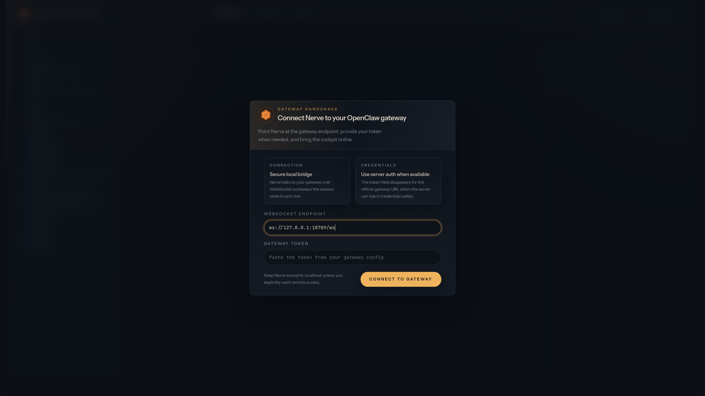
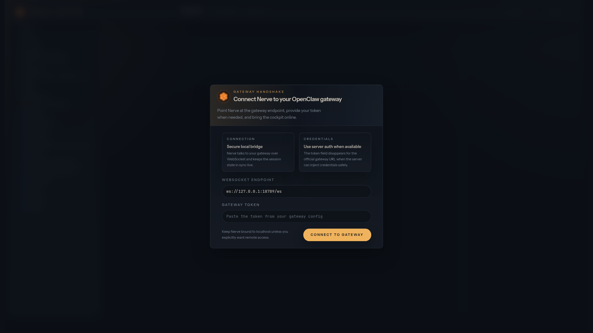

<div align="center">


# Nerve Center

**The AI cockpit. Forked, enhanced, and personalized.**

*A community fork of [Nerve](https://github.com/daggerhashimoto/openclaw-nerve) — the OpenClaw dashboard that makes you say "oh, now I get it."*


[](https://github.com/PfhorScore/Nerve-Center)
[](LICENSE)
[](NERVE-CHANGELOG.md)

</div>

```bash
curl -fsSL https://raw.githubusercontent.com/PfhorScore/Nerve-Center/main/install.sh | bash
```
> *Run the installer, live in 60 seconds*



<div align="center">
  
  
  <br />
  
</div>

---

## What makes Nerve Center different

All the power of Nerve, plus a whole lot more:

### 🧩 Drag-and-Drop Panel System
Your workspace, your layout:
- **Drag panels** to reorder or move between left/right sidebars
- **Collapse individually** or nuke the whole sidebar with one button
- **Resize vertically** with slick drag handles — double-click to auto-fit
- **Right-click** any panel header to move it to the other sidebar
- Everything **persists** across sessions (localStorage, no DB required)

### 📝 Thoughts Panel v2
Your brain, organized into thought bubbles:
- **`---` separates thoughts** — split your notes into individual cards
- **Check off completed** thoughts (dimmed, stays visible for history)
- **Auto-detect completion** — send to chat, auto-checks when AI finishes
- **Hover actions** — copy, send to chat, research each thought
- **Click to edit** any thought inline
- **Server-backed sync** — notes available across all devices via `scratchpad.md`

### 📚 Library Panel
References, citations, and images from your chats:
- **Auto-extracts** all URLs, citation links, and images from messages
- **Deduplicated** by URL — clean, organized
- **Tabs** for All / Links / Images with live counts
- **Search** filter to find specific references
- **Favicon previews** and image thumbnails

### 🧠 AI-Powered Research Tab
Full Perplexity-class research experience:
- **Quick & Deep search modes** using any OpenClaw-compatible provider
- **Rich markdown answers** with inline citation links `[1]`
- **Hover previews** — favicon, title, and snippet on any source
- **Tabbed results**: All, Sources, Images, Links
- **AI auto-sort** — one click splits conversations into topic-based threads
- **Follow-up suggestion chips** — click to dive deeper
- **Thread sidebar** with AI-generated titles

### ⚡ Agent Activity Panel
Live tool call and reasoning display:
- Tool calls grouped by chat message (collapsed by default)
- See names, descriptions, and status (running ✓ error)
- Finished activity persists for review
- Separate from the chat stream — clean conversation

### 🎭 Collapsible Sidebars
Both sidebars collapse to icon strips — like VS Code:
- **Hover to expand** — full panel on hover (250ms delay)
- **Right-click** the strip to toggle hover behavior
- Independent collapse per sidebar
- Smooth 400ms width animation

### ⌨️ Perplexity-Style Input
Clean messaging layout:
- **Buttons below text** — attach, research, send below the input area
- **Live markdown preview** — toggle with the 👁️ icon
- **File upload** now accepts all file types (.md, .txt, etc.)

### 🎯 Quality-of-Life
- **Smooth streaming text** — append-only DOM, no flickering
- **Tab title pulses** during generation ("⚡ Thinking...")
- **Smooth scroll** on new messages
- **Brain icon** on send during generation
- **Copy button** on messages (hover to reveal)
- **"Still thinking…"** indicator at 15s
- **Collapse only chevron** — no accidentally collapsing messages
- **Cmd+K** command palette
- **Research This?** tooltip — select text, send to research
- **Changelog dialog** — click version in StatusBar
- **Right-click context menus** — Copy, Paste, Move panel
- **NERVE CENTER** branding

### 🎨 And everything Nerve already gives you
Multi-agent fleet control, voice I/O, kanban workflows, workspace management, session trees, crons, charts, and more.

---

## Get started

### One command

```bash
curl -fsSL https://raw.githubusercontent.com/PfhorScore/Nerve-Center/main/install.sh | bash
```

### Manual install

```bash
git clone https://github.com/PfhorScore/Nerve-Center.git
cd Nerve-Center
npm install
npm run build
```

**Requires:** Node.js 22+ and an [OpenClaw gateway](https://openclaw.ai).

---

## What's new

### v0.2.0 — May 27, 2026 — Thoughts, Library & Polish 🧠

**Thoughts Panel v2** — Complete rethink. Thoughts are now individual cards split by `---` markers. Each card has a completion checkbox, inline editing, and hover actions (copy, send to chat, research). Send a thought to chat and it auto-checks off when the AI finishes generating.

**Library Panel** — New sidebar panel that automatically extracts all URLs, citation links, and images from your chat conversations. Deduplicated, tabbed (All/Links/Images), searchable, with favicons and thumbnails.

**Server-Backed Scratchpad** — Thoughts sync across all devices via a `scratchpad.md` file on the server. One-time migration merges content from multiple browsers.

**Perplexity-Style Input** — Send/attach buttons moved below the text input area. Labeled buttons. File upload now accepts all file types.

**Tool Calls Hidden from Chat** — Tool calls and thinking messages no longer clutter the chat view. They appear exclusively in the Activity Panel.

**Research View Cleanup** — Removed the workspace sidebar from research mode. Just the thread sidebar, research panel, and thoughts panel.

**Sidebar Alignment** — Chat/Research/Tasks buttons in the header now align with the chat content area.

**And more** — 14 files changed, 937 insertions, multiple new components and panels.

### v0.1.0 — May 26, 2026 — The Big One 🚀

**Panel System** — Workspace, Agents, Memory, and Thoughts are now fully draggable, collapsible, resizable, and persistent. Move panels between left/right bars, stack them however you want, and it remembers your layout.

**Research Tab v2** — Hero empty state with suggestion chips, history search filtering, icon-only search buttons, and no more phantom empty threads on refresh.

**Chat UX** — Only the chevron collapses messages (no more rage-clicks), copy button with feedback, "Still thinking…" at 15s, always-wrench activity toggle with pulsing dot.

**Thoughts Panel** — Markdown scratch pad that saves its content. Edit, preview, collapse. Perfect for jotting ideas while the AI works.

**Cmd+K** — Command palette packed with panel controls, view switching, and file creation.

**v0.1.0** marks Nerve Center's first independent version — no longer tracking upstream v1.5.x.

See the full **[changelog](NERVE-CHANGELOG.md)** for detailed changes.

---

## Architecture

```text
Browser ─── Nerve Center (:3080) ─── OpenClaw Gateway (:18789)
 │            │
 ├─ WS ───────┤ proxied to gateway
 ├─ SSE ──────┤ file watchers, real-time sync
 └─ REST ─────┘ files, memories, TTS, models
```

**Frontend:** React 19 · Tailwind CSS 4 · shadcn/ui · Vite 7
**Backend:** Hono 4 on Node.js

---

## Credits

Nerve Center is a fork of **[Nerve](https://github.com/daggerhashimoto/openclaw-nerve)** by daggerhashimoto. All original work belongs to the Nerve contributors. This fork adds custom enhancements and personalizations on top of that solid foundation.

---

## License

[MIT](LICENSE)
